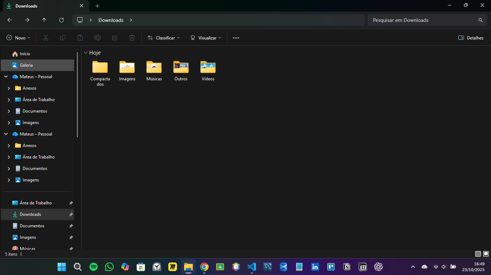

# Organizador de Downloads (Python) 🐍

Script simples e eficiente para **organizar automaticamente** a pasta *Downloads* por tipo de arquivo.  
Ele identifica a extensão de cada arquivo e move para pastas como **Imagens**, **Documentos**, **Vídeos**, **Músicas**, **Compactados** e **Outros** (personalizável).



---

## ✨ O que o script faz

- Varre a pasta definida em `caminho_da_pasta`
- Mapeia extensões → pastas (ex.: `.pdf` → `Documentos`)
- Cria as pastas destino se não existirem
- Move os arquivos para seus respectivos diretórios

---

## 🗂️ Estrutura de mapeamento (personalizável)

No código, ajuste o dicionário `mapa_de_pastas` conforme sua necessidade:

```python
mapa_de_pastas = {
    "Imagens": [".jpg", ".jpeg", ".png", ".gif", ".bmp"],
    "Documentos": [".pdf", ".docx", ".txt", ".xlsx", ".pptx"],
    "Vídeos": [".mp4", ".mov", ".avi", ".mkv"],
    "Músicas": [".mp3", ".wav", ".aac"],
    "Compactados": [".zip", ".rar", ".7z"],
}
```

---

## 🧭 Roadmap de melhorias

- Log em arquivo (.log) com data/hora
- Exclusão segura de arquivos vazios / temporários
- Suporte a subpastas (recursivo) com opção incluir_subpastas=True
- Filtro por idade do arquivo (ex.: mover apenas arquivos com +7 dias)
- Interface CLI com argparse (ex.: --dir, --dry-run, --recursivo)
- Testes unitários com pytest
